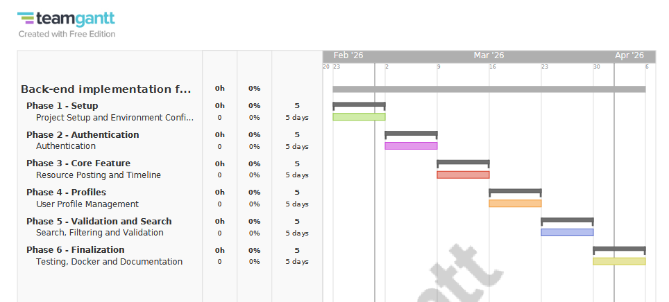

# Skill Swap Hub

> A community-driven platform for sharing and discovering skills, built with Flask and MongoDB.

**Module:** COM4113 Tech Stack  
**Student Name:** Chris Botty  
**Student ID:** 2506555  
**Date:** 13/04/2026

---

## Project Overview

### Choice of Tech Stack

This project uses **Flask** as a server-side web framework and MongoDB as the database.
**Flask** was selected since its a lighweight web application framework written in Python that is designed to make getting started quick and easy (Zyneto Global Technologies, 2026). it allows for session management and form procession, which aligns with the assignments goal of using backend, middleware and server-side rendering.
**MongoDB** was chosen as a database solution because it is well suited for making user-generated content such as profiles, resources or comments. I also picked this daatabase solution since MongoDB can handle high volume and scale both vertically or horizontally to accomodate large data loads (MongoDB, 2024).
For the alternative frameworks, the option was Express (Node.js), however I decided to use Flask since it alisngs with the modules teachings and materials.

### Project Goals

The goal of this project was to transition the front-end interface from assignment 1, into a fullly functionind Community Skill Swap Hub application.
The original UI was deisnged using Figma, for this assignemnt I had to reimplent the application using Flask to support tdata storage and authentication. The completed system allows users to register, log in and manage profiles.

---

## Technologies Used

| Technology | Purpose |
|---|---|
| Python 3.x | Server-side programming language |
| Flask 3.1 | Web framework for routing, sessions, and request handling |
| MongoDB Atlas | Cloud-hosted NoSQL database for persistent data storage |
| PyMongo 4.10 | Python driver for connecting Flask to MongoDB |
| Werkzeug | Password hashing (PBKDF2) and secure file handling |
| Jinja2 | Template engine for rendering dynamic HTML |
| Bootstrap 5.3 | Front-end CSS framework for responsive design |
| HTML5 / CSS3 | Page structure and custom styling |
| Git / GitHub | Version control and code hosting |
| dnspython | Required for MongoDB Atlas SRV connection strings |

---

## Installation Instructions

Follow these steps to set up the project on your own machine.

### Prerequisites

- Python 3.8 or higher installed
- A MongoDB Atlas account (free tier) at [https://www.mongodb.com/atlas](https://www.mongodb.com/atlas)
- Git
- code editor (e.g. VS Code)

### Step-by-Step Setup

1. **Clone the repository:**
   ```bash
   git clone [YOUR GITHUB REPO URL]
   cd skill-swap-hub
   ```

2. **Create a virtual environment (recommended):**
   ```bash
   python -m venv venv
   ```
   - Windows: `venv\Scripts\activate`
   - macOS/Linux: `source venv/bin/activate`

3. **Install dependencies:**
   ```bash
   pip install -r requirements.txt
   ```

4. **Set up MongoDB Atlas:**
   - Create a free cluster on MongoDB Atlas
   - Create a database user with a username and password
   - Whitelist your IP address (or allow access from anywhere for development)
   - Copy the connection string

5. **Update the connection string:**
   - Open `app.py` and `seed_data.py`
   - Replace the `MONGO_URI` value with your own connection string
   - Replace `<username>`, `<password>`, and `<cluster>` with your actual details

6. **Seed the database with sample data (optional):**
   ```bash
   python seed_data.py
   ```

7. **Run the application:**
   ```bash
   python app.py
   ```

8. **Open in your browser:**
   - Go to `http://127.0.0.1:5000`

---

## Replication Guide

To replicate this project exactly on another device:

1. Follow the Installation Instructions above.
2. Ensure your MongoDB Atlas cluster is on the **M0 Free Tier**.
3. In the Atlas dashboard, go to **Network Access** and add your IP address (or `0.0.0.0/0` for development).
4. Update the 'MONGO_URI' value in the '.env' file with your Atlas connection string.
5. Run `seed_data.py` to populate the database with identical test data.
6. The application should now behave identically to the original development environment. To run the application:
```bash
python app.py
```

If the connection fails, check:
- Your IP is whitelisted in MongoDB Atlas
- The username and password in your connection string are correct

---

## Features Implemented

<!-- Tick the features you have completed by changing [ ] to [x] -->

### Core Features (MVP)
- [ ] User registration with username, email, and password
- [ ] Password hashing using Werkzeug
- [ ] User login with credential verification
- [ ] Session management (logged-in state)
- [ ] User logout
- [ ] Profile page displaying user details
- [ ] Profile editing (bio, hobbies, email)
- [ ] Profile photo upload
- [ ] Resource posting form (title, link, description, category)
- [ ] Timeline displaying all shared resources from the database

### Extended Features (50%)
- [ ] Category filtering on the timeline
- [ ] Keyword search across titles and descriptions
- [ ] Server-side validation for all mandatory fields
- [ ] Custom 404 error page
- [ ] Custom 500 error page
- [ ] Timestamps displayed on resource cards
- [ ] Database seeding script for testing
- [ ] User's posted resources shown on their profile page

---

## How to Use

1. **Register:** Create an account with a username, email, password, and optional profile details.
2. **Log In:** Use your credentials to access the platform.
3. **Share a Skill:** Post a resource with a title, optional link, description, and category.
4. **Browse Timeline:** View all shared resources, filter by category, or search by keyword.
5. **View Profile:** See your details and all resources you have shared.
6. **Edit Profile:** Update your bio, hobbies, email, and profile photo.

---

## Technical Architecture

### Database Schema

This project uses MongoDB (NoSQL). The database contains two collections:

**Users Collection**
| Field | Type | Description |
|---|---|---|
| _id | ObjectId | Auto-generated unique identifier |
| username | String | Unique username chosen at registration |
| email | String | User's email address |
| password | String | Hashed password (PBKDF2 via Werkzeug) |
| bio | String | Short biography |
| hobbies | String | Comma-separated list of hobbies |
| profile_photo | String | File path to the profile image |
| created_at | DateTime | Timestamp of account creation |

**Resources Collection**
| Field | Type | Description |
|---|---|---|
| _id | ObjectId | Auto-generated unique identifier |
| title | String | Title of the shared resource |
| link | String | URL to the external resource |
| description | String | Description of the resource |
| category | String | Category (e.g. Programming, Design) |
| author | String | Username of the person who posted it |
| author_photo | String | File path to the author's profile photo |
| created_at | DateTime | Timestamp of when the resource was posted |

### Why NoSQL (MongoDB)?

MongoDB was chosen as the database solution for this project as it is flexible and scalable. It also has a strong developer community, so if users are struggling they can gind precious resources for chancing answers to questions and getting support (Raza, 2023).
The Community Skill Swap Hub stores data such as user profiles, hobbies and comments, which do not follow a fixeed structure. With MongoDB's document-based model, it can allow these entities to be stored as JSON-like document, which makes it easier to add, remove or modify these fields during development without any complex schema migrations.
A relational database such as MySQL was considered, however it would required predefined tables and relationships, which could limit the flexiblity during iterative development.

---

## Framework Comparison

| Aspect | Flask | Django |
|---|---|---|
| Type | Micro-framework | Full-stack framework |
| Learning curve | Relative gentle learning curve. Concepts such as routing and request handling are easy to understand | Steeper learining curve, due to many built-in features |
| Built-in features | Minimal features. Authentication and database handling are added | Extensive built-in features, which include authentication and form handling |
| Flexibility | Highly flexible, developers can choose which library and extention to use | Less flexible, developers have to follow a set structure |
| Best suited for | Small to medium applications and prototypes | Large, complex applications which require rapid development. |

Flask was picked for this project because of its lightweight and minimalist design. Since its lightweight, it leads to faster startup times, reduces memory footprint and it is easier to deploy compared to Djago (Zyneto Global Technologies, 2026). Since because of its micro-framework apporuyach, it can provide full control over routing, authentication and database interactions, which allows backend concpets to be implemented instead of it being hidden behing a framework abstraction. Flask also allows applications to be integrated with MongoDB without any rigid project structure. With this Flask can support the Community Skill Swap Hub, in creating a flexible and funcitional platform.

---

## Good Software Attributes

### Separation of Concerns

The Flask routing logic is in the app.py, where each route is responsible for handling HTTP requests, managing sessions and determing which response or template should be returned.
<br>
The presentation layer is isolated in the templates directory, which contains HTML files responsible for the user interface structure and layout. The dynamic data is injected in the Jinga placeholders, ensuring that the templates remain free from business logic. Static assets such as CSS, images and uploaded files are stored in a static directory
<br>
The database logic is separate by the routing and is encapsulated by MongoDB and configurated within the database/connection.py file. This ensures that the database configuration details are not duplicated across the routes. The flask routes interact with the database with clear references, which imporve maintanability and readability.
<br>
By separating routing, data acess and presentation into components, the applicatoin becomes easier to understand, debug and extend. This follows good practices and demostrrates good software principles for back-end focused applications.


### Readability and Maintainability

The code is organised to priorities readability and maintanability through clear and logical structures. Flasks routing and application and centralised in the app.py, while the database access are seperated in a database directory. The HTML templates are stored in a template folder and are only used for presentation, with dynamic data passed in from Flask routes using Jinja templating. Static assets such as CSS, images and uploaded files are stored in a static directory.
Consistent naming variables are used throughout the project for variable, collections and reoutes, which makes the code more easier to follow and understand. Functions are accopanied by comments and docstrings that explain behaviours where validation or authentication is happening. This organisation provides clarity, reduces cognitive load and makes the application easier to debug.

---

## Technical Challenges and Reflection

One challenge I faced during development was connecting the Flask application to MongoDB. The application failed to connect to the data base due to issues with the connection string and network access configuration. This resulted in errors when users tried to register or load resources. To avoid this, I carefully reviewed the MongoDB setup, moved the connection string into a environment variable with a .env file. This solved the issue and improved security by preventing personal data from being breached.
Another challenged i faced, was that Python was not installed correctly during the development of the machine. This prevent the Flask application from running, which lead to command-line errors while trying to start the server. This issue was resolved when installing the correction version of Python and ensuring it was added to the systems PATH.
Another challenged faced, was when I was running the website and some of the components didnt display or function as expected. Attempts wre made to resolve this issue with route logic or checking if the variables were correct. Still the issue was persistent and couldnt be resolved.

---

## Legal and Ethical Considerations

### Data Protection (GDPR)

This application collects a lot of personal data such as usernames, email addresses, or user-generated content. No sensitive personal data is collected. With GDPR principles, only information necessary for authentication and community interaction is stored.
User passwords are never stored in plain text. Instead, they are stored using secure hashing methods provided by Werkzeug before being stored in the MongoDB database.
Any user data stoed in the MongoDB database cannot be accessed publicly and is only accessable through Flask routes. While account deletion is not functionable, the system allows for user data to be removed from the database if required, which follows GDPR rules.

### Data Protection (Password Hashing and Legal necessity)
User authentication data is protected through the implementation of password hashing, which ensures that passwords are never stored in plain text. During user registration, passwords are processed using Werkzeug's generate_password_hash() function before it is saved to the MongoDB database. When a user logs in, the password is checked using check_password_hash(), which allows authentication without exposing the original password.
This approach reduces the risk of personal data being compromised if the database get breached, as hashed passwords cannot be easily reversed. It also ensures that the developers cannot view the user passwords, which supports confidentiality.
With GDPR, it doesnt discuss technical implementations such as password hashing. However, in article 32 of GDRP says that the controller and the processor shall implement appropriate technical and organisational measures to ensure a level of security appropriate to the risk (GDPR, 2018).
By implementing password hashing with secure configauration such as environment variables, the application follows GDPR principles while aligning with industry best practices for user data protecttion.

### Content Moderation

As a community-driven application, users are allowed to share learning resources, which could intrduce ethical risks such as misleading or harmful content being shared. To prevent this, basic safeguards are implemented with a server-side alidation to ensure that all he fiels are present and correctly formatted.

### Accessibility

The application aims to follow accessibility practices. Pages are srtucutred using HTML elements, and alt text for screen readers.
Despite this, i believe the navigation could be further improved. Such as adding higher contrast colour schemes, or more extensive keyboard

### Ethical responsibility of moderating shared links
As a community driven platform, the Skill Swap hub allows users to share external links and learning resources, which could introduce ethical responsiblities. There are risks of users sharing misleading, inapropriate or harmful content, which could harm the safety and trust of the community.
<br>
In the pilot implementation, basic ethical safeguards are implemented through server-side validation, which esnures that the required fields are present and correctly formatted before submitting. However, this validation isnt sufficient, for full moderation. In a real-world deploymeny,  there would have been more more moderation such as reporting tools, community guidelines or link analysis that identify harmful or malicious resources.
<br>
By balancing the knowledge sharing with user safety is an is a key ethical challenge for a platform like this. By recognising these risks and designing the system to support future moderation, the project shows ethical awareness.

---

## Risk Assessment

| Risk | Likelihood | Impact | Mitigation Strategy | Implemented? |
|---|---|---|---|---|
| Database connection failure | Medium | High | Try/except blocks around all database operations; user sees a friendly error message instead of a crash | Yes |
| Invalid or missing user input | High | Medium | Required fields in HTML forms; server-side validation before saving to the database | Yes |
| Unauthorised access to protected pages | Medium | High | Session checks on routes; redirect to login if not authenticated | Yes |
| Exposure of sensitive configuration data | Low | High | Using environment variables and excluding secrets from version control | Yes |
| Limited accessibility support | Medium | Low | Using semantic HTML | Partially |
| Collecting unnecessary personal data | Low | Medium | Apply data minimasation by only collecing required personal data | Yes|
| Incosistent data strucutre | Low | Medium | Using flexible MongoDB schema | Yes|

## Applied Risk Assessment

### Invalid or Malicious User input
Users can submit incomplete, or intentionally harmful inputs, which could lead to data corruption or unexpected application behaviour<br>
### Mitigation<br>
to Mitigate this, a server side validation is implemented for all forms. All required fields are checked before they are inserted into the database, and constraints like the maximum or minimum lengths are enforced. Any erros are shown as error messages.<br>
### Evidence in Code<br>
Validation logic is present in routes handling user registration using flash() messages.
<br><br>

### Unsafe File Uploads
Allowing users to upload files could introduce the risk of malicious or unsupported files types being stored in the server<br>
### Mitigation<br>
Uplods are validated by an extensoin before being saved<br>
### Evidence in Code<br>
The function allowed_file() is used to restric uploads and only allows the approved image formats

<br><br>

### Data Leakage 
Storing user passwords insecurely can cause serious secruity and legal risk, and a potential breach could happen<br>
### Mitigation<br>
Passwords are never stored in plain text. Instead they are hashed using Werkzeug's password hashing before its saved in MongoDB.<br>
### Evidence in Code<br>
The application uses generate_password_hash() and check_password_hash() for authentication.

---
## Mitigation Evidence
Several mitigation strategies were implemented to improve the security and stability of the application.

### Password Hashing and Secure Authentication
User passwords are protected using password hashing to reduce the risk of personal data being exposed. Passwords are hashed using Werkzeug's generate_password_hash() function before storage and verified using check_password_hash(). Plain-text passwords are never stored.
This reduces the risk of potential data breaches and it aligns with GDPR security requirements for protection of personal data.

### Evidence in Code<br>
Password hashing and verification functions are in app.py

### File Upload Validation
Ti reduce the risk of invalid or malicious user input, a server-side validation was implemented in routes such as user registration and resource submission.

### Evidence in Code<br>
The validation logic was implemented in Flask routes using flash() and conditional checks.
---
---

## Development Timeline (Gantt Chart)



| Week | Task | Status |
|---|---|---|
| Week 1 | Set up Flask project and structure and MongoDB connection | Complete |
| Week 2 | Implement user registration, login, session management and password hashing | Complete |
| Week 3 | Build resource posting, database storage,  and timeline display | Complete |
| Week 4 | Add profile management and photo upload | Complete |
| Week 5 | Implement search, filtering, error handling, and validation | Complete |
| Week 6 | Testing, documentation,Docker configuration, and final refinements | Complete |

---

## Version Control

**GitHub Repository:** https://github.com/ChrisB0tt/Tech-Stack-Assignment-2.git

Github was used to commit any changes or development to the project. It is a very useful application as it allows you to track and mangage changes to your code overtime and it allows your work to be shared (GitHub, 2024).

---

## Visual DMD Representation
This Data Model Diagram represents the structure of the MongoDB database used in the Community Skill Swap Hub. It consists of two collections, users and recourses. A relationship exists between users and resources, where a signle user may post multiple resources. <br>


---
## References

1. Zyneto Global Technologies. (2026). Advantages of Using Flask for Web Development. Zyneto Global Technologies. https://zyneto.com/blog/advantages-of-using-flask  ‌
2. MongoDB. (2024). Why Use MongoDB And When To Use It? MongoDB. https://www.mongodb.com/resources/products/fundamentals/why-use-mongodb
3. GitHub. (2024). About GitHub and Git. GitHub Docs. https://docs.github.com/en/get-started/start-your-journey/about-github-and-git
4. Raza, A. (2023, January 2). 10 Reasons Why MongoDB is the Best NoSQL Database - Ahsan Raza - Medium. Medium; Medium. https://medium.com/@ahsancommits/10-reasons-why-mongodb-is-the-best-nosql-database-17ad10e4319f
5. GDPR. (2018). Art. 32 GDPR – Security of processing | General Data Protection Regulation (GDPR). General Data Protection Regulation (GDPR). https://gdpr-info.eu/art-32-gdpr/
6. 
7. 
8. 

---

## Generative AI Disclosure

This assignment used generative AI in the following ways for the purposes of completing the assignment: [choose from: brainstorming, research, planning]